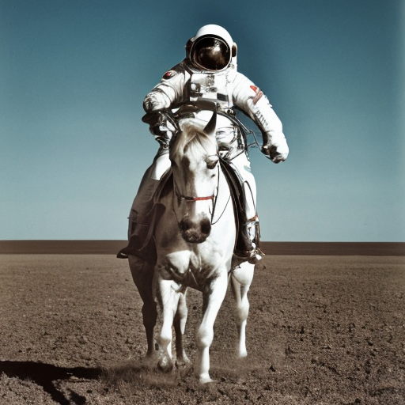
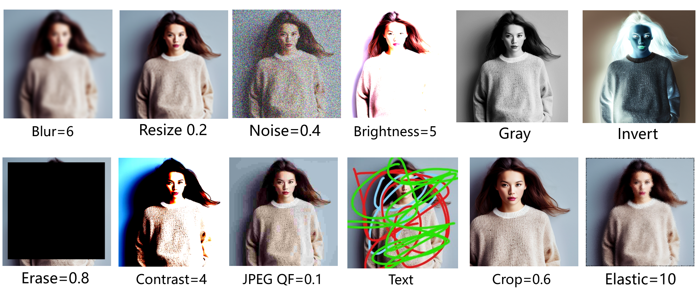
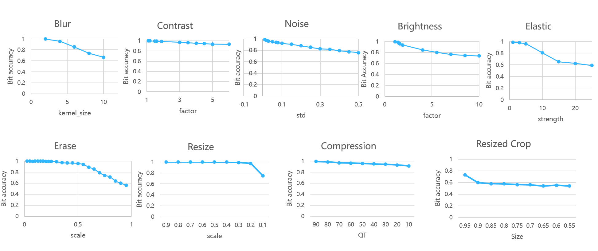

# A watermark for Diffusion Models


<p align="center"><a href="./README.md">中文</a> | English</p>

 

> [!Note]
> This is an **unofficial** implementation of the Paper by Kejiang Chen et.al. on **Gaussian Shading: Provable Performance-Lossless Image Watermarking for Diffusion Models**

 

## Features

- [x] **100% bit accurate** of extracted message under lossless conditions for watermarked images. :tada:
- [x] Exceptional robustness against various types of high-intensity distortion attacks. E.g. an average bit accuracy rate of 90% with **JPEG compression QF=10**. :+1:
- [x] Compatibility with **different versions of Stable Diffusion**: v1-4, v2-0, v2-1. :tada:
- [x] Both **command-line SD** and **script for SD-webui (More recommended)** are supported to use. :+1:
- [x] **No additional training required**. Merely modifying the initial noise with nearly no impact on image quality. :sparkles:
- [x] **Plug-and-play** :heavy_check_mark:


## Generated images

<div align=center>

</div>
<p align="center">Watermarked image on the left | Image without watermark on the right</p>


<div align=center>

    <p align="center">Images after distortions</p>
</div>
<div align=center>

    <p align="center">Bit Accuracy Result</p>
</div>

## Tutorial for SD-CLI

### Generating Watermarked Images

1. Download and ensure the original [Stable Diffusion project](https://github.com/Stability-AI/stablediffusion) is able to generate images.
2. Add the following codes into `txt2img.py` in the `scripts` folder of Stable Diffusion.

First, add the following codes at the end of the function `parse_args()`

```python
parser.add_argument(
    "--message",
    type=str,
    default="",
    help="watermark message",
)
parser.add_argument(
    "--key_hex",
    type=str,
    default="5822ff9cce6772f714192f43863f6bad1bf54b78326973897e6b66c3186b77a7",
    help="key_hex",
)
parser.add_argument(
    "--nonce_hex",
    type=str,
    default="05072fd1c2265f6f2e2a4080a2bfbdd8",
    help="nonce_hex",
)
```

And you will get things like this

```python
parser.add_argument(
    "--bf16",
    action='store_true',
    help="Use bfloat16",
)
# Here are the new codes
############################
parser.add_argument(
    "--message",
    type=str,
    default="",
    help="watermark message",
)
parser.add_argument(
    "--key_hex",
    type=str,
    default="5822ff9cce6772f714192f43863f6bad1bf54b78326973897e6b66c3186b77a7",
    help="key_hex",
)
parser.add_argument(
    "--nonce_hex",
    type=str,
    default="05072fd1c2265f6f2e2a4080a2bfbdd8",
    help="nonce_hex",
)
##############################
opt = parser.parse_args()
return opt
```


Second, add the following codes after the line `for n in trange(opt.n_iter, *desc*="Sampling"):`

```python
from gs_insert import gs_watermark_init_noise
Z_s_T_arrays = [gs_watermark_init_noise(opt,opt.message) for _ in range(opt.n_samples)]
start_code = torch.stack([torch.tensor(Z_s_T_array).float() for Z_s_T_array in Z_s_T_arrays]).to(device)
```

It will be like

```python
for n in trange(opt.n_iter, desc="Sampling"):
    # Here are the new codes
    ############################
    from gs_insert import gs_watermark_init_noise
    Z_s_T_arrays = [gs_watermark_init_noise(opt,opt.message) for _ in range(opt.n_samples)]
    start_code = torch.stack([torch.tensor(Z_s_T_array).float() for Z_s_T_array in Z_s_T_arrays]).to(device)
    ##############################
    for prompts in tqdm(data, desc="data"):
        uc = None
        if opt.scale != 1.0:
            uc = model.get_learned_conditioning(batch_size * [""])
```


3. Execute the command below to generate watermarked images.

```shell
python scripts/txt2img.py --prompt "a professional photograph of an astronaut riding a horse" \
--ckpt ../ckpt/v2-1_512-ema-pruned.ckpt \
--config ./configs/stable-diffusion/v2-inference.yaml \
--H 512 --W 512  \
--device cuda \
--n_samples 2 \
--key_hex "5822ff9cce6772f714192f43863f6bad1bf54b78326973897e6b66c3186b77a7" \
--nonce_hex "" \
--message "lthero"
```


#### Parameter Explanation

* --ckpt: The [model file](https://huggingface.co/stabilityai/stable-diffusion-2-1/tree/main) for Stable Diffusion.

* --config: The [accompanying config file](https://github.com/Stability-AI/stablediffusion/tree/main/configs/stable-diffusion) for Stable Diffusion.

* --n_samples: Indicates the number of batches to generate, with 3 images being generated per batch.

* --key_hex: The encryption key (32 bytes).
  * Input in **hexadecimal**, used to encrypt the message using the **ChaCha20 encryption algorithm**.

* --nonce_hex: The nonce (16 bytes).
  * Input in **hexadecimal**, used for message encryption.
  * If `nonce_hex` is not provided, it will **default to the middle 16 bytes of `key_hex`**.

* --message: The watermark message to be embedded, supports up to 256 bits (32 bytes). Messages exceeding this length will be truncated, and shorter ones will be padded.

> [!important]
>
> * Both `key_hex` and `nonce_hex` can be **left unentered**, in which case a random 32-byte `key_hex` and a random 16-byte `nonce_hex` will be generated.
> * The `message` can also be left blank, in which case a random 256-bit (32-byte) content will be generated.
> * All the above parameters will be saved in **info_data.txt** (located in the root directory of the Stable Diffusion project).
> * If it is the first run, just keep `key_hex` and `nonce_hex` be unentered, so that the code is automatically generated; Or use the following code to **generate** `key_hex` and `nonce_hex`

```python
import os
key = os.urandom(32)
nonce = os.urandom(16)
print(key.hex())
print(nonce.hex())
```


-----------

## [Recommended]Tutorial for SD-WebUI

> This work implement watermark embedding functionality in the form of a script based on the [Stable Diffusion-WebUI](https://github.com/AUTOMATIC1111/stable-diffusion-webui) project

### Script Installation

1. Place the `GS_watermark_insert.py` file from this project's `scripts` directory into the `scripts` directory of Stable Diffusion-WebUI.
2. After you `restart webui`, you will find the script options at the bottom of the **txt2img and img2img** sections 
3. Click the script options then you can use "**GS_watermark_insert**".


### Three Parameters Provided by the Script

* Key: Requires input in **hexadecimal format of 32 bytes**.
* Nonce: Requires input in **hexadecimal format of 16 bytes**.
* Message: The content must **not exceed 32 bytes** (Any strings are allowed).

 


> [!note]
> * You can only fill in the Key and leave the Nonce empty; it will automatically select a Nonce.
> * Both Key and Nonce can be left blank, in this case, **Key and Nonce will be generated automatically**.


> [!important]
>
> In the root directory of Stable Diffusion-WebUI, you can find info_data.txt, which records the Key, Nonce, and Message.

### Image Generation

* After filling in the three parameters provided by the script, proceed with the image generation as usual. The generated images will have a watermark embedded.


---------


## Extracting Watermark Messages

#### Method 1

1. Modify the parameters inside `extricate.py`.
2. Run `extricate.py` with the command `python extricate.py`.

#### Method 2

Pass parameters through the command line:

```shell
python extricate.py \
--single_image_path "path to image" \
--image_directory_path "directory to image" \
--key_hex "xxxxxxxxxx" \
--original_message_hex "xxxxxxxxxxxxx" \
--num_inference_steps 50 \
--scheduler "DDIM" \
--is_traverse_subdirectories 0
```

#### Parameter Explanation

* single_image_path: For **single image processing**, input the **path of the image to be checked**, e.g. "/xxx/images/001.png".
* image_directory_path: For **batch processing**, the **directory path** of images to be checked, e.g.  "/xxx/images".
  * Only one of these two modes can be selected at a time; if both are not empty, it will only process by directory path.
* key_hex: Input in **hexadecimal**, retained in info_data.txt.
* nonce_hex: Input in **hexadecimal**, retained in info_data.txt.
* original_message_hex: When you generated a picture,the input message was converted to hexadecimal and **retained in info_data.txt**, you can find it there easily.
* num_inference_steps: The number of reverse inference steps, set default as **50 steps**
  * It's not recommended to increase further more. If the process of decoding is slow, it can be appropriately reduced to 20 steps.

* scheduler: Choose the sampler
  * with "DPMs" and "DDIM" as options, set default as DDIM.

* is_traverse_subdirectories: Whether to recursively extract from subdirectories. 
  * If set to 0, it only processes images in the directory
  * If set to 1, it processes images in all subdirectories (including subdirectories of subdirectories,etc).


> [!caution]
>
> The original_message_hex must be input in hexadecimal format, strictly following what is entered in info_data.txt.

After running `extricate.py`, it will output the image name and Bit accuracy:

```shell
v2-1_512_00098-3367722000JPEG_QF_95.jpg
Bit accuracy:  1.0
```

> [!note]
>
> If batch processing is used, a result.txt file will be generated in the input directory, recording the results for each image.
>
> If recursive processing is used, each subdirectory under image_directory_path will have a result.txt file, and image_directory_path will have a result.txt recording the average Bit accuracy in each subdirectory.